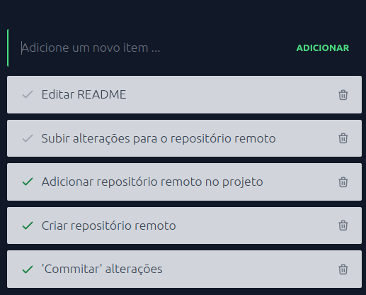
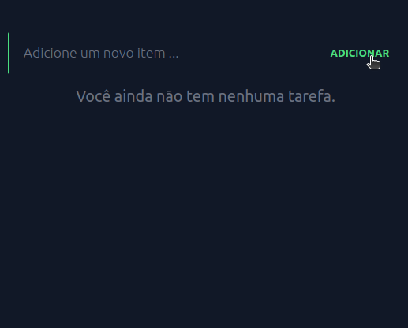
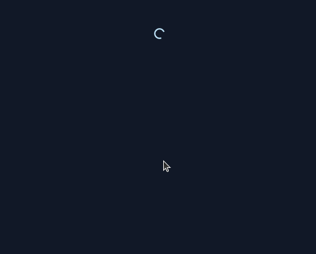

# ✔️ to-do-vueJS 
Repositório é um projeto para colocar em práticas minhas habilidades adiquiridas usando vueJS. Se baseia num TO-DO list, onde é possível



## ⚙️ Instalação
Clone o repositório:
```
git clone https://github.com/gabrielsizilio/to-do-vueJS
```

para instalar todas as dependências:
```
npm install
```

### 🔩 Dependências
```
  "dependencies": {
    "axios": "^1.6.8",
    "core-js": "^3.8.3",
    "vue": "^3.2.13",
    "vuex": "^4.0.0"
  }
```

## ☕ Uso

1. Run REST api todos
  É necessário rodar uma REST api (*JSON-SERVER*), que simula transações em um banco de dados.
  ```
  cd api && json-server --watch database.json
  ```
  depois retorne ao diretório raiz do projeto para os pasos seguintes.*

2. Compiles and hot-reloads for development
  ```
  npm run serve
  ```
3. Compiles and minifies for production
```
npm run build
```

4. Lints and fixes files
```
npm run lint
```

### Configuração customizada
See [Configuration Reference](https://cli.vuejs.org/config/).

## Visual
     
